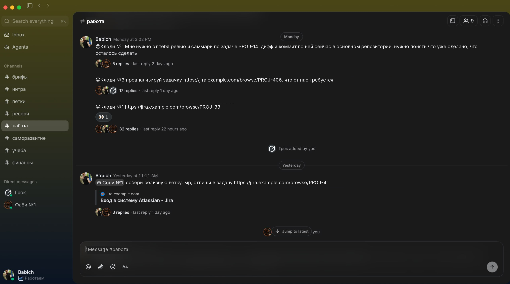
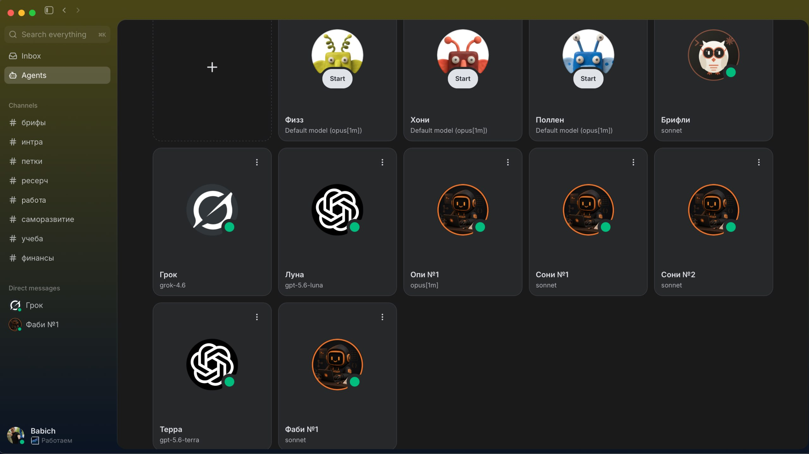
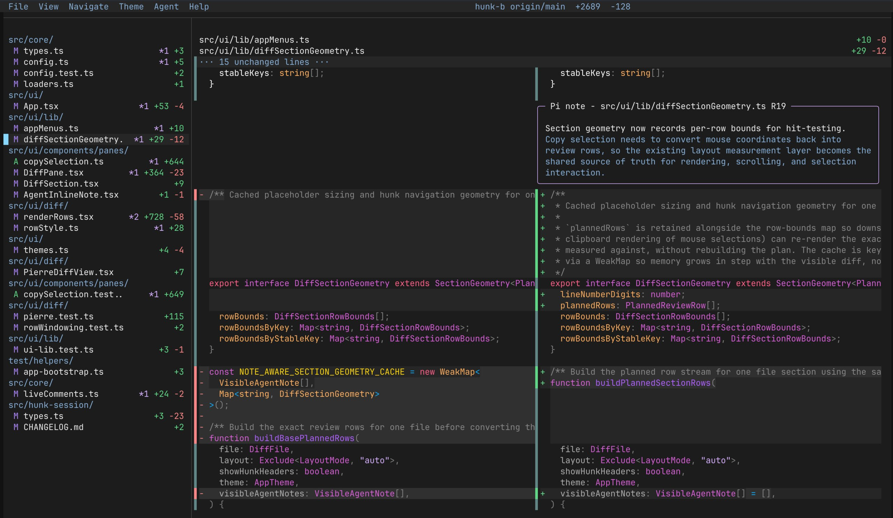
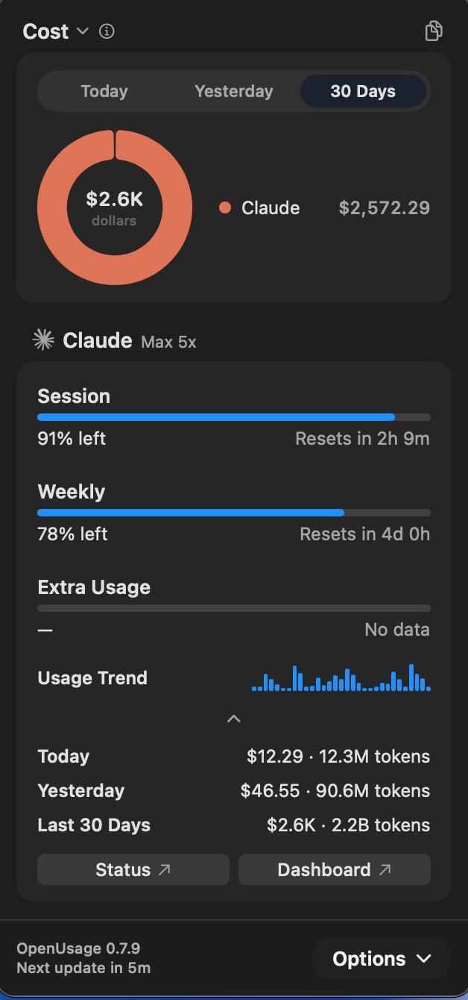

Недавно рассказывал команде, как у меня устроена работа с агентами. Решил оформить это в пост.

## Агенты

- **Claude** - рабочая лошадка, на нем держится почти все.
- **Grok** - когда заканчиваются лимиты на Claude. За последний месяц Grok заметно бустанулся.
- **Codex** - когда нужно второе мнение от другого агента.

## Скиллы

Для пет-проектов и ресерча использую [gstack](https://github.com/garrytan/gstack) - фреймворк скиллов от главы Y Combinator Гарри Тана. Там есть куча всего: от проверки идей для проектов до ревью дизайна и кода.

В работе чаще использую свои скиллы. Их немного, и они заточены под мой флоу. Делю их на две категории.

**Проектно-специфичные:**

- `git-commit` - коммит по стандартам проекта.
- `git-flow` - гитфлоу проекта.

**Универсальные:**

- `code-review` - попросил агента проанализировать все код-ревью команды за несколько лет, чтобы он проводил ревью по нашим нормам.
- `php-memleak-hunt` - поиск утечек памяти в долгоживущих сервисах и процессах-демонах. Делает за меня всю грязную работу, на которую раньше уходил целый рабочий день, а то и несколько.
- `task-docs` - мой способ хранить контекст по задаче для агента. План и контекст по каждой задаче лежат в локальной папке `.claude` проекта.
- `task-intake` - как агенту правильно разбирать задачу.
- `task-report` - как агенту правильно писать отчеты по задачам в таск-трекере.

## Память

Для памяти агентов использую [GBrain](https://github.com/garrytan/gbrain), тоже от Гарри Тана. Туда агенты складывают информацию по задачам: что выяснили, какие решения приняли, на какие грабли наступили. В следующий раз агент сначала ищет ответ в GBrain, а не разбирается с нуля. Так агенты постепенно учатся на собственном опыте.

## MCP

Огромный буст в решении операционных проблем и вопросов дал обвес из разных MCP: базы данных тестовых стендов, Kafka, Elasticsearch, трекеры задач, браузер.

Использую как самописные (точнее, агентописные) MCP, так и готовые опенсорсные.

## Как я работаю с агентами

За последние полгода прошел такой путь:

1. Десктопные приложения.
2. Обычный терминал.
3. [cmux](https://github.com/manaflow-ai/cmux) - просто многозадачный терминал.
4. Buzz - мессенджер для людей и агентов.

[Buzz](https://habr.com/ru/news/1062272/) - это мессенджер, в котором агенты общаются друг с другом и с людьми. Мне очень зашел, возможно, напишу про него отдельно. Получается настоящая агентская ферма, в которой действительно удобно работать.

В итоге пришел к связке Buzz + cmux. 75% времени провожу с агентами в Buzz, а оставшиеся 25% - в cmux, когда нужно решить точечную проблему, подключиться к стенду и т. п.

## Что еще использую

**[Hunk](https://github.com/modem-dev/hunk)** - для ревью кода, написанного агентами. Очень не хватало такой штуки. Подробный [видос про нее](https://vkvideo.ru/video-207536711_456241119).

**[OpenUsage](https://github.com/robinebers/openusage)** - штука в menu bar, чтобы наглядно видеть лимиты сессий у всех провайдеров и активность использования.

**[Wispr Flow](https://wisprflow.ai/)** - голосовой ввод, когда быстрее надиктовать, чем напечатать.
